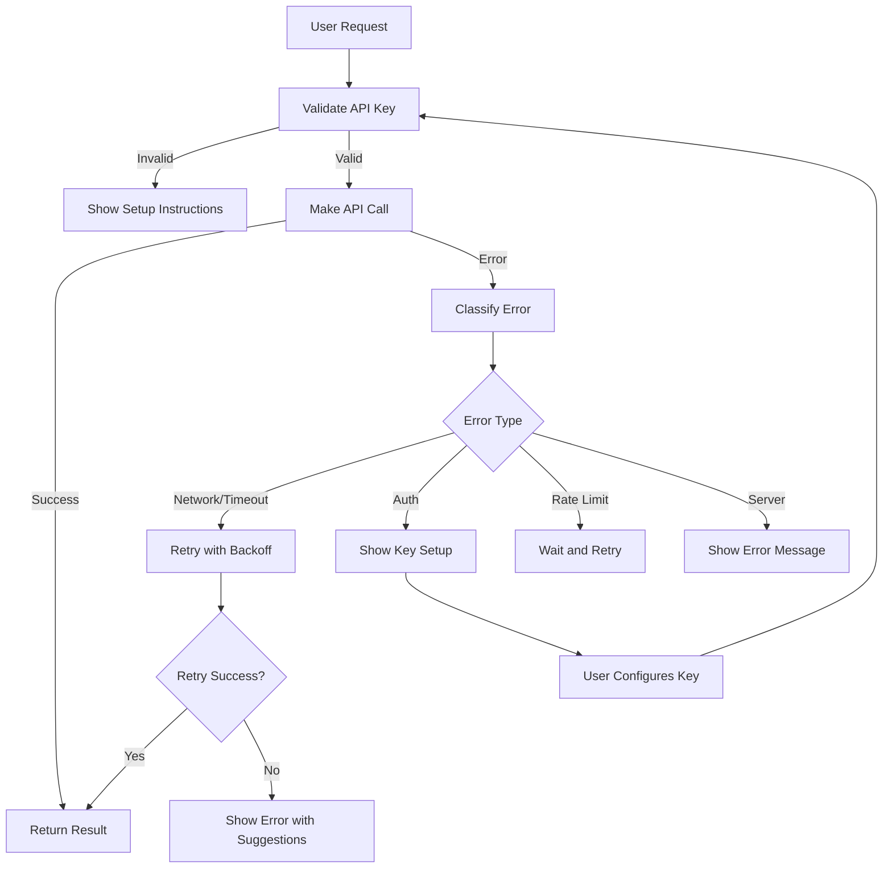

# OpenRouter Error Handling & API Key Validation Implementation Plan

## Overview
Enhance OpenRouter integration with robust error handling and API key validation to improve user experience and prevent common configuration issues.

## Current Issues Identified

### 1. API Key Validation
- **Current**: Basic check in `getApiKey()` function
- **Problem**: No user-friendly error messages, no validation of key format
- **Impact**: Users see generic errors when API key is missing or invalid

### 2. Error Handling
- **Current**: Basic try-catch with generic error messages
- **Problem**: No specific error categorization, no retry logic for transient errors
- **Impact**: Poor user experience when API calls fail

### 3. Environment Variable Management
- **Current**: Simple fallback between OpenRouter and Anthropic keys
- **Problem**: No validation of environment setup, no helpful setup instructions
- **Impact**: Users struggle to configure the application correctly

## Implementation Plan

### Phase 1: Enhanced API Key Validation (Priority 1)

#### 1.1 Create API Key Validation Service
```typescript
// services/api-key-validation.ts
export interface APIKeyValidationResult {
  isValid: boolean;
  provider: 'openrouter' | 'anthropic' | 'none';
  key: string;
  error?: string;
  suggestions?: string[];
}

export function validateAPIKeys(): APIKeyValidationResult {
  // Comprehensive validation logic
}
```

#### 1.2 Enhanced getApiKey() Function
- Add key format validation
- Provide specific error messages
- Include setup instructions in error messages
- Support multiple key formats (OpenRouter, Anthropic)

#### 1.3 Environment Setup Helper
```typescript
export function getSetupInstructions(): string {
  return `
  To configure OpenRouter API:
  1. Get an API key from https://openrouter.ai/keys
  2. Add to .env file: VITE_OPENROUTER_API_KEY=your_key_here
  3. Restart the application
  
  Alternative: Use Anthropic API key as fallback
  `;
}
```

### Phase 2: Comprehensive Error Handling (Priority 2)

#### 2.1 Error Classification System
```typescript
export enum OpenRouterErrorType {
  NETWORK_ERROR = 'network_error',
  AUTH_ERROR = 'auth_error',
  RATE_LIMIT = 'rate_limit',
  INVALID_REQUEST = 'invalid_request',
  SERVER_ERROR = 'server_error',
  TIMEOUT = 'timeout',
  UNKNOWN = 'unknown'
}

export interface OpenRouterError {
  type: OpenRouterErrorType;
  message: string;
  statusCode?: number;
  retryable: boolean;
  suggestions: string[];
}
```

#### 2.2 Enhanced Error Handling in OpenRouter Service
- Implement error classification
- Add retry logic for transient errors
- Provide user-friendly error messages
- Include actionable suggestions

#### 2.3 Progress Callback Enhancement
```typescript
export interface EnhancedProgressCallback {
  (phase: GenerationPhase, progress: number, message?: string, error?: OpenRouterError): void;
}
```

### Phase 3: User Experience Improvements (Priority 3)

#### 3.1 Error Display Components
- Create error banner component for API issues
- Add setup wizard for first-time users
- Implement key validation in settings

#### 3.2 Retry and Fallback Logic
- Automatic retry for network errors
- Graceful fallback to other providers
- User-controlled retry options

#### 3.3 Logging and Debugging
- Structured error logging
- Debug mode for troubleshooting
- Error reporting for common issues

## Implementation Details

### File Changes Required

1. **services/openrouter.ts**
   - Enhance error handling in `generateWithOpenRouter()`
   - Add retry logic with exponential backoff
   - Improve error messages

2. **services/ai-provider.ts**
   - Update provider selection logic
   - Add error handling for provider failures
   - Implement fallback mechanisms

3. **services/api-key-validation.ts** (NEW)
   - Create comprehensive validation service
   - Add setup instructions and suggestions

4. **components/Header.tsx**
   - Add API status indicator
   - Show configuration warnings

5. **components/CenteredInput.tsx**
   - Add error display for API issues
   - Show setup instructions when needed

### Error Handling Flow



### Testing Strategy

1. **Unit Tests**
   - API key validation logic
   - Error classification
   - Retry mechanisms

2. **Integration Tests**
   - End-to-end error scenarios
   - Fallback provider testing
   - UI error display

3. **User Experience Tests**
   - Error message clarity
   - Setup instruction effectiveness
   - Error recovery workflows

## Success Criteria

### Functional Requirements
- [ ] API key validation provides clear, actionable error messages
- [ ] All error scenarios have appropriate user feedback
- [ ] Retry logic handles transient errors automatically
- [ ] Fallback mechanisms work seamlessly
- [ ] Setup instructions are comprehensive and accurate

### User Experience Requirements
- [ ] Users can easily identify and fix configuration issues
- [ ] Error messages are helpful and not technical
- [ ] Application remains functional during API issues
- [ ] Setup process is guided and intuitive

### Technical Requirements
- [ ] Error handling doesn't break existing functionality
- [ ] Performance impact is minimal
- [ ] Logging provides useful debugging information
- [ ] Code is maintainable and well-documented

## Implementation Timeline

### Week 1: Foundation
- [ ] Create API key validation service
- [ ] Enhance getApiKey() function
- [ ] Add error classification system

### Week 2: Core Error Handling
- [ ] Implement enhanced error handling in OpenRouter service
- [ ] Add retry logic with exponential backoff
- [ ] Update AI provider service

### Week 3: User Experience
- [ ] Create error display components
- [ ] Add setup instructions and guidance
- [ ] Implement status indicators

### Week 4: Testing & Polish
- [ ] Comprehensive testing
- [ ] User experience validation
- [ ] Documentation and cleanup

## Risk Mitigation

### Risks
1. **Breaking existing functionality** → Comprehensive testing and gradual rollout
2. **Complex error handling** → Keep error handling simple and focused
3. **User confusion** → Clear, actionable error messages
4. **Performance impact** → Minimal overhead, efficient retry logic

### Mitigation Strategies
- Maintain backward compatibility
- Use feature flags for new error handling
- Provide clear migration path
- Monitor error rates and user feedback

## Next Steps

1. **Review and approve this plan**
2. **Switch to Code mode for implementation**
3. **Start with Phase 1 (API Key Validation)**
4. **Implement incrementally with testing at each step**
5. **Validate with real-world usage scenarios**

This plan prioritizes the most critical user experience issues while maintaining the existing functionality and providing a solid foundation for future enhancements.